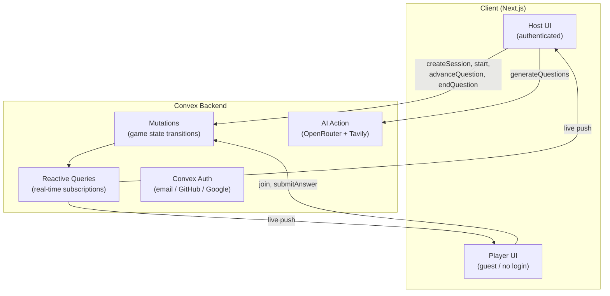

# Quizlr - Real-Time Multiplayer Quiz Platform

A **live quiz platform** powered by AI and real-time subscriptions. Generate questions from any topic, host a live room, and watch the leaderboard shuffle as answers land - no installs, no account required to play.

---

## Live Demo

**Deployed App:**
https://quizlr.mohdriaz.com

<picture>
  <source media="(prefers-color-scheme: dark)" srcset="https://github.com/user-attachments/assets/e4700c7c-b2fa-43f6-9b1e-864bf0ebcba3">
  <source media="(prefers-color-scheme: light)" srcset="https://github.com/user-attachments/assets/6aaf6cca-5f6a-435c-a9d1-0870f1ef603e">
  
</picture>


---

## Features

- **AI question generation** - paste a topic or some notes and get structured multiple-choice questions with explanations in seconds
- **Real-time gameplay** - Convex subscriptions push every answer the instant it lands; no polling, no refresh
- **6-character join codes** - players join from any device with a short code; no account or install needed
- **Time-based scoring** - faster answers earn more points (400–1000 per question, linear decay)
- **Live leaderboard** - scores re-sort on every screen simultaneously as answers come in
- **Practice mode** - hosts generate a shareable solo-practice link; anyone can attempt the quiz without a live session
- **Edit & regenerate** - tweak any question inline; regenerate a single one without losing the rest

---

## Architecture



---

## Tech Stack

### Frontend

- Next.js 16 (App Router)
- React 19
- Tailwind CSS v4

### Backend

- **Convex** - database, serverless functions, real-time subscriptions
- **Convex Auth** - email/password, GitHub OAuth, Google OAuth
- **Resend** - OTP email delivery

### AI

- **OpenRouter** - model API for question generation (`OPENROUTER_MODEL` env var, defaults to `openrouter/free`)
- **Tavily** - optional web search for richer topic context

---

## Database Schema

| Table          | Purpose                                                                                       |
| -------------- | --------------------------------------------------------------------------------------------- |
| `quizzes`      | Quiz metadata, time limit, optional `practiceCode`                                            |
| `questions`    | MCQs linked to a quiz (text, 4 options, correct index, explanation)                           |
| `sessions`     | Live game rooms with join code and state machine (`lobby → active → question_end → finished`) |
| `participants` | Host + guest players per session with running score                                           |
| `answers`      | Immutable answer records with points earned (idempotent submit)                               |

---

## Installation

Clone the repository:

```bash
git clone https://github.com/mohd-riaz/Quizlr.git
cd Quizlr
```

Install dependencies:

```bash
npm install
```

Create a `.env.local` file:

```env
CONVEX_DEPLOYMENT=dev:your-deployment
NEXT_PUBLIC_CONVEX_URL=https://your-deployment.convex.cloud
NEXT_PUBLIC_CONVEX_SITE_URL=https://your-deployment.convex.site
```

Set Convex environment variables:

```bash
npx convex env set JWKS ...
npx convex env set JWT_PRIVATE_KEY ...
npx convex env set AUTH_RESEND_KEY re_...
npx convex env set SITE_URL http://localhost:3000
npx convex env set AUTH_GITHUB_ID ...
npx convex env set AUTH_GITHUB_SECRET ...
npx convex env set AUTH_GOOGLE_ID ...
npx convex env set AUTH_GOOGLE_SECRET ...
npx convex env set OPENROUTER_API_KEY sk-or-v1-...

# Optional: override the default model
npx convex env set OPENROUTER_MODEL openrouter/free

# Optional: Tavily key for web-augmented question context
npx convex env set TAVILY_API_KEY tvly-...
```

---

## Running Locally

```bash
npm run dev
```

This starts both the Next.js frontend and the Convex dev server in parallel.

Open [http://localhost:3000](http://localhost:3000) in your browser.

---

## Deployment

- **Frontend + SSR:** Vercel
- **Backend + real-time:** Convex cloud

---

## Key Learnings

- Building a **role-aware single-route game view** where host and player share a URL but render different UIs
- Designing **normalized real-time game state** across five Convex tables with reactive subscriptions
- **Server-side scoring** to prevent clients from self-reporting points
- Streaming AI-generated MCQs through **OpenRouter** with Zod validation and structured error handling
- **Idempotent answer submission** indexed on `(sessionId, participantId, questionId)` to handle duplicate submits safely

---

## License

MIT License.
